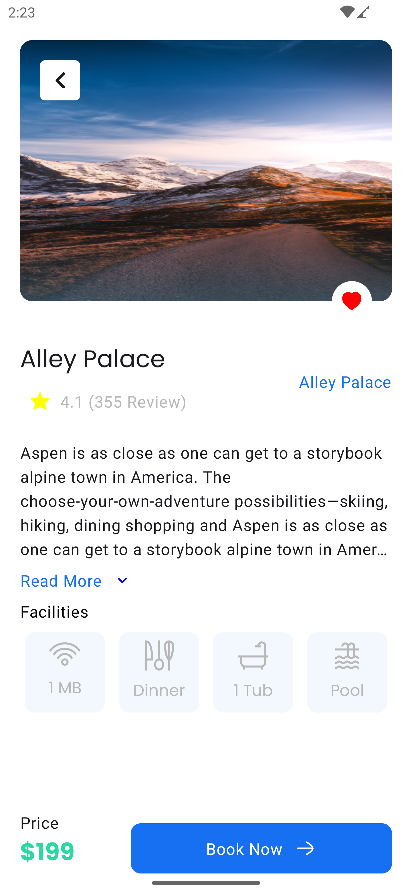

# Playing with Compose

Build a simple Travel app UI compose with navigation. 

### Figma Link 

https://figma.com/file/qo8Vt7bxiZrX8U1pJygczR/Aspen-Travel-App-Exploration--Mobile-App-Design-(Community)?type=design&node-id=0-11&mode=design&t=bcgRds9P640ec4YP-0

### Here are the Screenshots:

   
